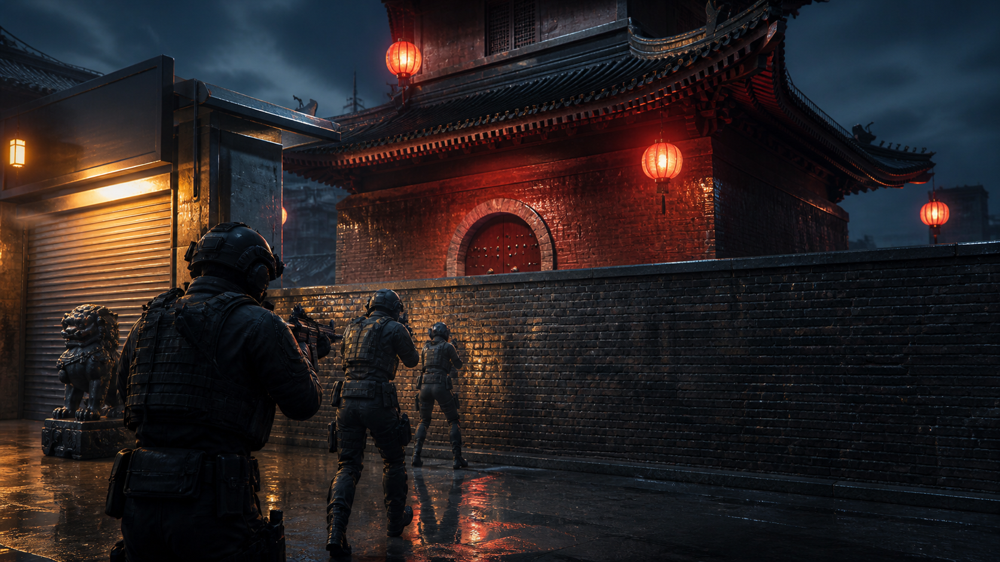
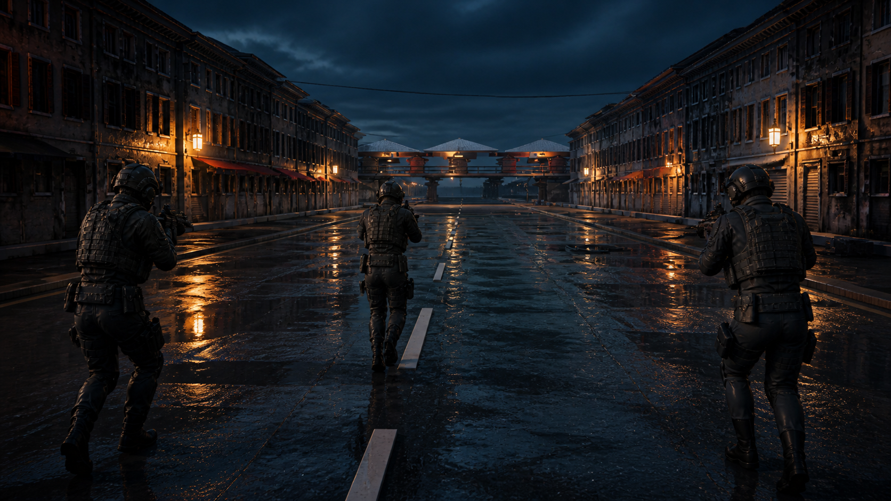
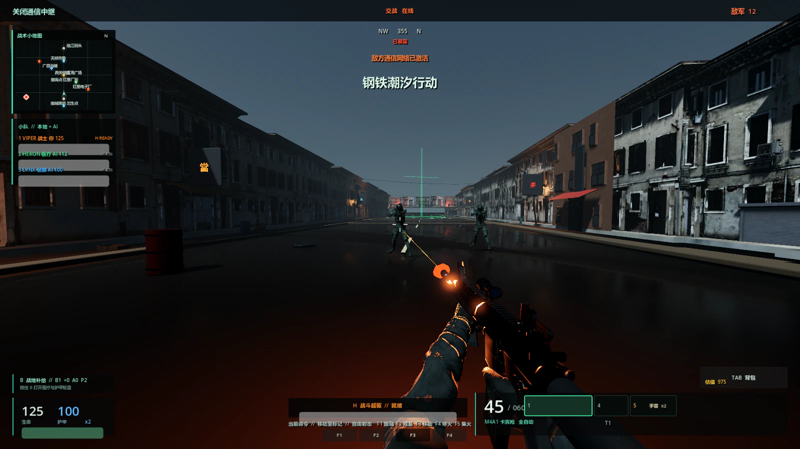
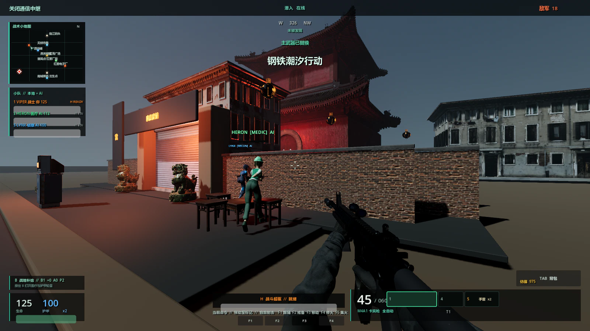
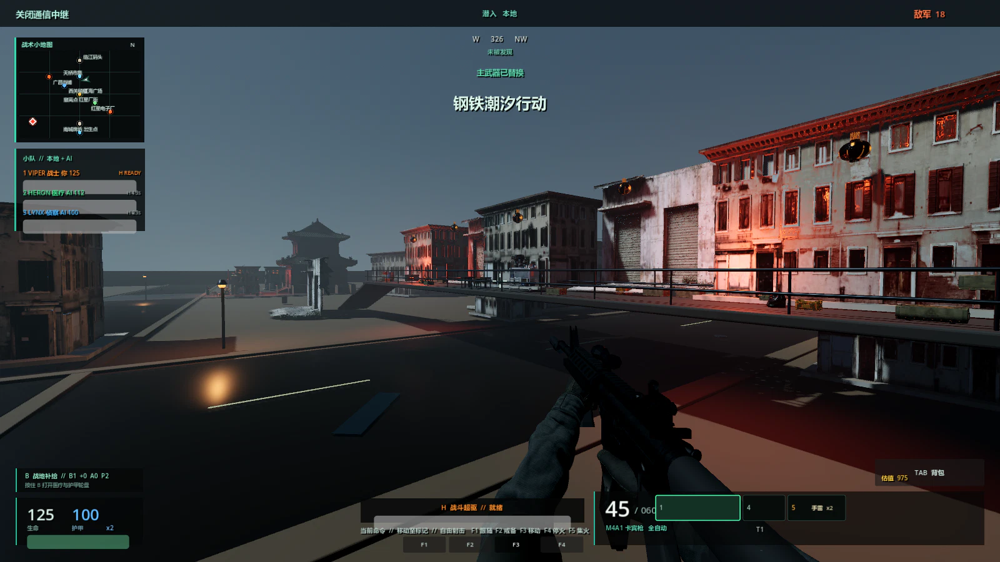
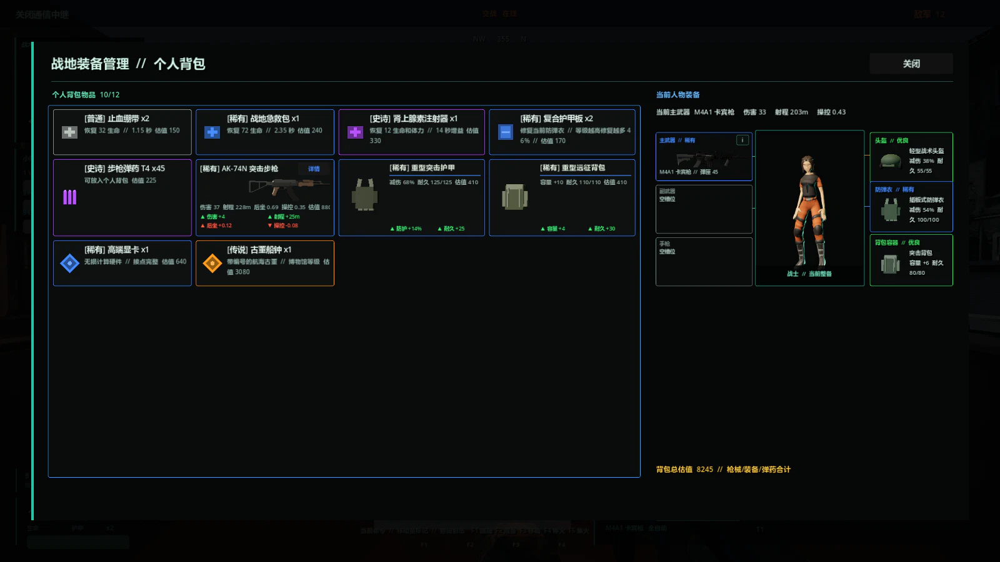
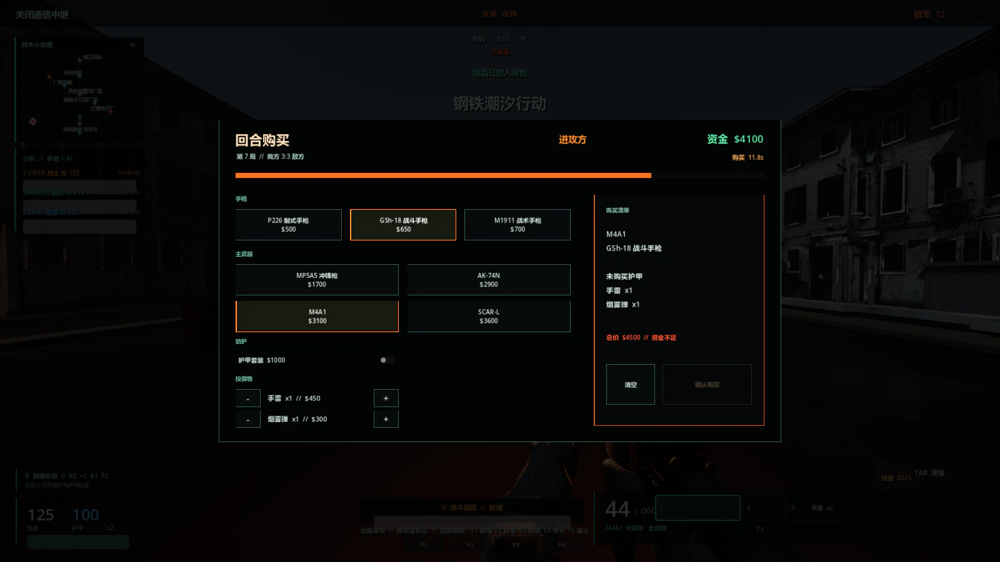

# Operation Steel Tide

简体中文 | [English](README.en.md)

**一款使用 Godot 4.6 与 C# 开发的开源战术撤离 FPS：指挥三人干员小队，带走成功撤离的装备，或进入独立的 5v5 爆破对局。**



*基于江海旧城制作的 AI 辅助项目封面图；当前版本的中文实机画面见下方画廊。*

[下载 Windows 版本](https://github.com/AetherRadar/operation-steel-tide/releases/latest) · [下载 macOS 版本](https://github.com/AetherRadar/operation-steel-tide/releases/latest) · [查看项目画廊](#项目画廊) · [查看小队 AI 源码](csharp/FreightTerminalWorld.Squad.cs) · [阅读架构说明](ARCHITECTURE.md)

[](https://godotengine.org/)
[](https://dotnet.microsoft.com/)
[](https://go.dev/)
[](LICENSE)

> **一分钟内开始游戏：** 下载最新的 Windows x64 或 macOS 通用 ZIP。完整解压后，在 Windows 运行 `PLAY.bat`，或在 macOS 打开 `Operation Steel Tide.app`；两种版本都不要求预装 Godot 或 .NET。

## 玩法亮点

- **真正承担职责的小队：** 五种干员职业、跟随/驻守/移动命令、职业技能、战斗、救援，以及联机玩家掉线后的 AI 自动接管。
- **有代价的撤离循环：** 操作实体任务目标，搜索建筑和阵亡干员，抵御增援，并且只存入高于部署基准的撤离收益。
- **另一套完整对局：** 在十二张地图中选择目前可玩的 Tideforge Arena、Harbor Locks、Tideglass Reactor 或 Bazaar Crossing，再进入包含手动购买、半场换边、加时、安放、拆除和职责型战术 AI 的 MR12 5v5 对局。
- **有实际取舍的配装：** 枪械、配件、护甲、背包、弹药口径与弹药品级共同影响持久化部署经济。
- **持续运转的敌对世界：** 敌对小队、驻军、平民、三阶段游荡 Boss、敌对飞机、车辆和高空路线会在任务周围同时活动。

> **仍在制作中：** 这是一个可以游玩的重系统原型，并非完成度达到商业发行标准的游戏。正式角色、武器和城市模块已经接入，但部分载具与世界区域仍需继续进行美术替换。可以尝试完成一次行动、检查源码，并[报告你遇到的第一个问题](https://github.com/AetherRadar/operation-steel-tide/issues)。

## 项目画廊

封面与下方小队主视觉均为 AI 辅助宣传图，取材自本项目的江海旧城环境和真实引擎截图；它们不会被冒充为游戏实机画面。



**小队推进。** 三人火力组沿雨后的江海骑楼街道接近高架市集。

### 当前中文实机画面

以下画面由 Godot 从当前版本的江海旧城直接生成，完整保留中文 HUD、第一人称武器和实际玩法界面。



**近距离交火。** 玩家使用 M4A1 在积水街道上接敌，武器姿态、枪口火光、小地图与战斗阶段均来自实际运行状态。



**小队协同。** 两名 AI 队友按移动命令穿过庙宇入口，中文界面同步显示职业、生命值与小队状态。



**战术态势。** 高架市集、任务目标、罗盘、小地图、弹药和快捷栏在同一实机画面中呈现。



**搜刮与配装。** 个人背包展示武器、弹药品级、医疗物资、护甲、背包和高价值物品，并与当前人物装备实时比较。



**5v5 爆破。** 独立 MR12 模式包含阵营、比分、资金、武器、防护与投掷物购买决策。

这五张截图可通过 `--capture-readme-zh` 确定性重拍。无 HUD 的开发机位仍可查看：[小队街道](docs/media/squad.webp)、[市集天桥](docs/media/city.webp)与[庙宇入口](docs/media/hero.webp)。

> **开发说明：** 这是一个使用 AI 辅助开发的个人原型。AI 工具参与了部分实现和文档工作；仓库所有者仍对设计决策、集成、调试和验证负责。本项目不声称自身是一套可直接用于生产环境的架构范例。当前边界、重构规则和已发布内容的已知来源，请参阅 [ARCHITECTURE.md](ARCHITECTURE.md)、[工程规范](docs/ENGINEERING_STANDARDS.md)和[内容来源记录](docs/CONTENT_PROVENANCE.md)。

## 运行发行版

### Windows

1. 打开[最新版本页面](https://github.com/AetherRadar/operation-steel-tide/releases/latest)。
2. 下载 Windows x64 ZIP，以及可选的 `.sha256` 文件。
3. 将完整 ZIP 解压到可写目录，然后运行 `PLAY.bat`。

发行包包含游戏、所需的 .NET 运行时文件，以及本地任务和进度服务。它不含安装程序，也不会请求管理员权限。由于这个原型没有进行代码签名，Windows SmartScreen 可能显示“未知发布者”警告；用于检查的源码、打包脚本、发行说明和校验值均可在本仓库中找到。

### macOS

1. 打开[最新版本页面](https://github.com/AetherRadar/operation-steel-tide/releases/latest)。
2. 下载 macOS 通用 ZIP，以及可选的 `.sha256` 文件。
3. 解压 ZIP，然后打开 `Operation Steel Tide.app`。

通用应用同时包含 Intel 与 Apple Silicon 代码以及所需运行时文件。可选本地服务未运行时，游戏使用内置离线任务与进度后备流程。当前应用尚未签名或公证，因此 macOS 首次启动时可能要求用户明确批准。

通过互联网联机但不想配置路由器端口转发时，主机玩家可以运行 [playit.gg](https://playit.gg/) UDP 隧道，将其指向 `127.0.0.1:28960`；只有主机需要安装客户端。其他玩家在 `JOIN GAME` 中输入完整的公网端点，例如 `example.gl.at.ply.gg:41237`。准确配置步骤、当前服务限制和专用网络替代方案请参阅 [ONLINE_PLAY.md](ONLINE_PLAY.md)。

## 从源码运行

安装 Godot 4.6.3 Mono 和 .NET 8 SDK。离线后备模式不强制要求 Go，但本地任务和进度服务需要 Go。

双击 `START_GAME.bat`。启动器会通过 `GODOT_MONO`、PATH 或默认下载目录查找兼容的 Godot 4.6 Mono，构建 C# 程序集，并在进入游戏前等待 Godot 完成资源导入。全新检出第一次运行时需要导入正式模型和纹理，因此可能稍慢。同一检出目录现在可以多开：共享的构建和导入准备阶段会依次排队，准备完成后各个 Godot 游戏进程可并行运行，并分别记录日志。每次实际启动都会把独立的导入和运行日志，以及本次启动器自建后端的日志写入 `logs/startup/<run-id>`，并在启动前显示该目录。日志清理不会删除启动器仍在运行的目录，并保留最近 20 个非活动运行目录；即使 Godot 自身返回 0，只要日志出现顶层错误，本次启动仍会明确失败。

第一个受启动器协调的游戏实例可以复用或启动 `127.0.0.1:8787` 上匹配的 Steel Tide 服务，并且只会停止由本次启动器创建的服务。之后从同一检出目录启动的并行游戏会使用内置离线任务流程、隔离的临时干员进度以及只读的共享设置，避免调试实例停止主实例的服务或覆盖其本地持久状态。来自其他检出目录或旧版不兼容启动器的服务也会保持不动。

启动前指定特定的 Godot 可执行文件：

```bat
set "GODOT_MONO=C:\Tools\Godot\Godot_v4.6.3-stable_mono_win64.exe"
START_GAME.bat
```

也可以在仓库根目录手动构建后端：

```bat
cd backend
go build -o ..\steel-tide-server.exe ./cmd/server
```

在 macOS 或 Linux 上，使用对应平台的 Godot Mono 可执行文件直接构建并启动客户端：

```bash
dotnet build OperationSteelTide.csproj
godot --headless --path . --import
godot --path .
```

## 开发者可以查看的内容

| 系统 | 源码入口 | 覆盖内容 |
| --- | --- | --- |
| 小队 AI 与真人/AI 槽位交接 | [`FreightTerminalWorld.Squad.cs`](csharp/FreightTerminalWorld.Squad.cs)、[`SquadMate.Combat.cs`](csharp/SquadMate.Combat.cs)、[`SquadNetwork.cs`](csharp/SquadNetwork.cs) | 命令、战斗移动、职业技能、救援路径、掉线替补和主机权威中继 |
| 撤离状态机与正式制作的飞机 | [`FreightTerminalWorld.Extraction.cs`](csharp/FreightTerminalWorld.Extraction.cs)、[`ExtractionAircraft.cs`](csharp/ExtractionAircraft.cs)和 [Blender 构建脚本](scripts/blender/build_extraction_aircraft.py) | 目标门槛、倒计时重置、Blender 到 GLB 的视觉骨架、旋翼与舱门枢轴动画、登机、小队座位、过场转移和任务完成 |
| 持久配装与战利品 | [`FreightTerminalWorld.Economy.cs`](csharp/FreightTerminalWorld.Economy.cs)、[`OperatorProgression.cs`](csharp/OperatorProgression.cs)、[`CombatHUD.LootComparison.cs`](csharp/CombatHUD.LootComparison.cs) | 原子化保存配置、部署成本、保留品级的物品转移、装备对比和撤离收益 |
| 确定性诊断 | [`FreightTerminalWorld.RuntimeDiagnostics.cs`](csharp/FreightTerminalWorld.RuntimeDiagnostics.cs)和[诊断参考](#诊断工具) | 开发期间使用的可脚本化玩法检查和真实引擎截图模式 |

救援倾转旋翼机是可编辑的 Blender 资产，不是运行时程序员美术。仓库内的 `.blend` 源文件位于 [`source_art/extraction_aircraft`](source_art/extraction_aircraft)，Godot 会加载导出的 GLB，并将之前的程序化飞机保留为安全的运行时后备。可在仓库根目录使用 Blender 5.x 重新生成两个资产文件：

```bash
blender --background --factory-startup --python scripts/blender/build_extraction_aircraft.py
```

<details>
<summary><strong>展开完整操作和玩法系统参考</strong></summary>

## 操作方式

- `WASD` 移动，`Shift` 冲刺，`C` 切换蹲伏或在冲刺时开始滑铲，`Z` 切换匍匐，站立时按 `Space` 跳跃
- `Q`/鼠标侧键 1 向左探身；`E`/鼠标侧键 2 向右探身
- `1`、`2`、`3` 分别切换主武器、副武器和手枪，`4` 拿出当前装备的近战武器，`5` 选择破片手雷，`6` 选择当前战术道具（烟雾弹）；手雷或战术道具库存为零时，相应槽位会隐藏；鼠标指针可用时也可以点击右下角槽位
- 鼠标左键射击，或在近战状态下连续输入三段斩击；存活时鼠标右键通过已安装的瞄具瞄准，倒地或淘汰后鼠标右键在仍存活的队友视角之间循环；`R` 执行完整弹匣换弹
- 选择手雷或战术道具后，鼠标左键使用物品；堆叠耗尽时自动切回之前的武器；`G` 始终是直接使用破片手雷的快捷键
- 短按 `F` 立即打开或关闭附近战利品，或者进入、离开停放的车辆；长按 `F` 操作任务终端
- `V` 在 AUTO 和 SEMI 射击模式之间切换，`T` 开关武器灯
- `X` 开始安装备用护甲板，再按一次 `X` 取消；安装时可以移动，但受到伤害会打断操作
- 按住 `B` 打开三区域医疗轮盘，瞄准绷带、战地医疗包或肾上腺素，随后松开 `B` 或单击使用；受到伤害会打断治疗
- `H` 激活当前职业技能
- `F1` 命令 AI 队友跟随，`F2` 命令其留守当前位置，`F3` 命令其移动到准星指向的世界位置
- `Esc` 打开暂停/设置菜单，可在其中切换中英文界面；任务失败后按 `Enter` 重新部署

游戏启动或重新获得焦点后，只有当射击和移动按键先恢复到未按下状态，相应输入才会生效。这可以避免启动游戏时的点击或一直按住的移动键意外触发射击或离开部署区。

## 小队与在线合作

每次部署都由三名干员组成。玩家在部署界面选择突击兵、医疗兵或侦察兵，另外两个位置由 AI 自动补齐。选择 `HOST GAME` 后只会创建房间并停留在大厅；其他玩家从 LAN 房间列表或手动地址加入后，由主机点击“开始行动”。所有电脑使用同一个世界种子加载地图，加载期间游戏保持暂停；主机会先发送敌人、小队、任务、增援、撤离和战利品的权威初始状态，全部准备完成后才统一解锁。真人断线后槽位由 AI 接管；主机断线时客户端会返回行动办公室。联机使用 UDP 端口 `28960` 上的 ENet，因此主机可能需要在 Windows 防火墙中允许本游戏。加入地址可以是 `host`（默认端口 `28960`）或 `host:port`，也支持 UDP 隧道分配的公网端点。免费 playit.gg 配置和替代方案请参阅 [ONLINE_PLAY.md](ONLINE_PLAY.md)。

- 突击兵拥有更高的基础生命、移动速度、换弹速度和射速。按 `H` 激活“战斗过载”，暂时大幅提升移动、射速、换弹和后坐力控制。
- 医疗兵会举起可见的创伤喷雾器。瞄准受伤或倒地队友后按 `H` 进行治疗或救援；喷射锥体内没有有效队友时，药物会用于医疗兵自身。
- 侦察兵会举起可见的脉冲扫描器。按 `H` 后可透过掩体显示附近敌人十秒。

AI 队友默认跟随玩家，只会在部署保护结束且发生接触后参战；他们会攻击附近敌人并使用职业技能。倒地干员会缓慢爬行并等待救援；在倒地队友旁按住 `F`，通过进度条完成救援。玩家倒地后，距离最近的存活 AI 队友会自动冲过来、跪下并持续救援；观战期间可按鼠标右键依照小队槽位循环查看仍存活的队友，倒地或阵亡成员会被自动跳过。如果救援者被击倒，下一名存活队友会接手。每名干员每条命只能被救援一次，第二次倒地无法再次救起。AI 医疗兵仍可喷射创伤药物，但救援和其他角色一样受每条命一次的限制。AI 职业技能的冷却时间是玩家的两倍，初始计时相互错开，并且不能连续两次由同一名 AI 触发；名单会显示 `H READY` 或各成员剩余秒数。敌对倾转旋翼机会巡逻，并向交战范围内的干员开火，直至被摧毁。网络客户端通过主机中继干员位置、职业、生命值、职业动作、可见枪火和玩家受到的伤害；主机还会拒绝冷却尚未结束时发送的职业动作。

## 任务流程

1. 在南部受保护的部署区出生。倒计时进入 READY 后，保护仍然有效。
2. 穿过部署线开始潜入。敌人综合使用视野锥、物理视线、距离、怀疑值累积、巡逻、掩体和声音传播进行感知。
3. 关闭通信中继，然后下载货运清单。在每个实体终端旁按住 `F` 完成操作。
4. 确认发生战斗后，根据后端任务设定的增援阈值累积响应等级。响应值填满时，三人快速反应部队会在七秒无线电警告后进入战场。关闭中继可以提高阈值，并降低已经累积的响应压力。
5. 完成两个目标后，远端海堤撤离点启用。沿北部勤务道路穿过铁路场和油罐区；绿色信标标记最终停机坪。击杀敌人可以提高奖励，但撤离并不要求清空敌军。

部署大厅同时也是持久化装备市场。玩家使用 18,000 点初始资金购买六种枪械之一（M4A1、AK-47、SCAR-L、MP5A5、M24 或 AXMC）、一套护甲、五个弹药品级之一，以及 30/60/90/180 发弹药包。弹药价格根据品级、数量和口径分别计算；选择拾荒者套装时仍可只带刀进入战场搜刮。友方 AI 队友和敌对撤离干员会携带武器部署；玩家购买的选择只有在本地档案完成原子化保存后才会应用。成功撤离时，只有高于部署基准的价值会存入 `user://operator_profile.json`，防止购买的装备被再次计为利润。

同一大厅还包含部署地图选择器。`MAP 01 // FREIGHT TERMINAL` 和 `MAP 02 // JIANGHAI OLD CITY` 是可玩的撤离行动，`MAP 03 // ORBITAL COMPLEX` 则保持可见但锁定。选择另一张可玩地图后会准备小队和配装并重新加载世界，因此任一时刻只会驻留一张 340 米 x 320 米的撤离地图。

江海旧城已经取代原有 Blackwater 工业视觉：单一 DCC 正式场景由项目构图与已记录的 CC0 来源资产共同组成。密集骑楼街巷串联广昌当铺、红星电子厂、庙宇院落、灯火市集天桥、两个彼此分离的高价值区域和实体任务终端。缓存场景加载、分级阴影剔除、简化碰撞代理、畅通车辆路线、屋顶通行、战利品、驻军和小地图地标共同保证地图可玩且可验证；旧地图 ID 与 `--validate-refinery-map` 命令继续保留，以兼容存档和诊断。

行动办公室还可以从十二张地图组成的池中启动独立爆破比赛。任务简报通过前后按钮一次展示一张地图：`TIDEFORGE ARENA`、`HARBOR LOCKS`、`TIDEGLASS REACTOR` 和 `BAZAAR CROSSING` 当前可玩，其余八个位置在对应几何资源完成前保持可见但锁定。Tideforge 的两个目标点分别位于开放式铸造厂和封闭装配车间。Harbor Locks 将 Kenney 的 CC0 City Kit (Industrial) 模型重新组合成一片船闸区，包含泵站、控制建筑、两条狭长岸边水道、三条进攻路线和硬掩体转点路线。Tideglass Reactor 完全弃用那套反复出现的蓝色工业包：施工塔楼与吊机、完整砖砌反应堆大楼、市政十字路口、两座各不相同的边界闸门、橙灰色模块化厂房和街道设施由七套 CC0 来源中的 46 个互不重复模型文件组成。六条可供角色胶囊体通行的路线连接两个目标点，并保留不同的进攻与转点选择。Bazaar Crossing V2 则推翻旧有的空旷镜像平面：136 米 x 112 米战区内，A 是可进入的双层商院，B 是完整覆顶的仓库市集，四段室内房间组成 S 形 Mid，北侧回防在屋顶市场中连续折叠；A Gallery、B Balcony 与 Mid Mezzanine 各自只影响一个局部区域，并分别通过两座楼梯接入三维 AI 路线。

每场比赛采用 MR12 5v5：玩家和四名 AI 队友对阵五名敌人，先赢 13 回合者获胜；中场交换阵营并将资金重置为 $800；加时要求净胜两回合，且每四回合交换阵营。每回合开始前有 15 秒购买阶段，期间战斗冻结，界面按准确价格提供副武器、主武器、护甲和手雷。初始 $800 可购买 P226 或 M1911，但买不起主武器；确认购买只扣除一次校验后的总价，超时则接受当前可负担的选择，或仅持刀开始。回合胜利奖励 $3,000；失败基础奖励为 $1,900，并按连败增加 $500；安放或拆除奖励 $300；资金上限为 $9,000。敌人使用相同价格阶梯购买装备，爆破模式与撤离模式的进度和资金彼此隔离。玩家小队防守时，敌方 AI 会选择炸弹携带者按路线行进并安放炸弹，其他进攻者架枪；进攻方会借助掩体完成拆除，防守方则进行转点回防。

可玩区域约为 340 米 x 320 米。原始货运码头仍是部署设施，扩建区域增加了停放货运车厢的铁路场、维修机库、溢出集装箱堆场、四罐燃料区、码头起重机，以及通往海堤撤离点的路线。多个敌对三人小队会在地图各处分离的出生点部署，并与玩家、其他敌对小队和驻军 NPC 交战；NPC 优先追猎这些小队，平静时则转为搜刮建筑。分级战利品（普通→传奇）会在建筑中按稀有度发光；右下角背包控件显示枪械、装备和弹药的库存总价值。中文界面会本地化新的背包和品级文本。新的地面和波纹金属 PBR 表面来自 Poly Haven 的 CC0 资产，来源链接记录在 `assets/textures/LICENSE.md`。

TIDE HUNTER 是拥有 900 点生命的唯一游荡 Boss，会敌视玩家、友方队员、驻军和敌对干员。它不会待在固定竞技场内，而是沿覆盖各主要区域、包含 14 个路径点的 230 米 x 209 米路线巡逻；它使用定制 AXMC 追猎目标，并逐步进入远程猎杀、潮汐涌动和激流过载阶段。后两个阶段会加入信号清晰的径向脉冲，可伤害所有阵营。小地图标记持续跟踪这个游荡威胁；阶段变化广播会提示其升级，但不会长时间显示铺满屏幕的生命条。击败它后会留下可搜索的传奇物资箱，其中包含它的 AXMC、7 倍瞄具、.338 Magnum 弹药、重型护甲、独特的 Tide Hunter 刀具涂装和高价值应答器。

原本构成天际线的十一座建筑现在全部属于可玩住宅环。每座 6 至 13 层塔楼都有可供角色站立通过的高挑街道入口、带地毯条和照明的走廊，以及七种轮换房间原型：家庭公寓、诊所、疏散避难所、维修公寓、安保站、隐蔽走私据点和社区厨房。44 个带碰撞的转角附楼，以及墙面冷凝器、雨水罐、公用设施电缆、车道标线和掩体箱填补了塔楼之间的空隙。33 个可搜索住宅物资点在所有塔楼中分布与医疗、疏散、工坊、安保、违禁品、食品储藏和家庭用品相符的物资，每个物资点现在至少包含一种可用药品。分层楼板内部设有封闭折返楼梯核心，包括两段畅通梯段、4.96 米 x 1.8 米的中间转台、内凹中央脊柱、井道墙，以及通往每层走廊的门；同时还有连续扶手、栏杆、安全条、公用设施柜、楼层标识和可通行屋顶出口。每座塔楼二层的第一扇空中连桥门外还设有镀锌消防梯，包括 36 级独立碰撞台阶、地面平台、桥高转台、护栏和梯梁，使玩家无需先进入建筑就能从街道抵达玻璃平台。22 座宽 3.5 米的航天风格连桥将所有塔楼连接成封闭的公共二层环路，并提供第二组高空路线。透明侧面与顶棚玻璃、齐腰防护矮墙、青色灯带和裸露结构肋骨在保证每段桥梁均可实际通行的同时，保留长距离步枪视线。六名固定的 M24 驻军射手分布在选定的长桥上，形成反狙击威胁；友军和敌对 AI 小队仍保留部署时的武装。39 名非战斗人员分布在地面层和高层，包括居民、疏散人员、医疗志愿者、社区警卫和公用设施工人；他们会在房间内走动，敌人接近时寻找掩护，并各自提供治疗、侦察、车辆维修或补给等一种情境协助。环区周围停放的勤务卡车和庭院车辆可按 `F` 进入，使用 WASD 驾驶，并可冲撞敌人；卡车会自动爬过低矮路缘和道具，完全卡住时提示“倒车脱困”。远处的倾转旋翼机可以被击落，但其装甲炸弹无法拦截；炸弹以 20 米/秒下落，必须在命中前躲开。

医疗轮盘消耗真实背包物品，而不是无限次数的技能。绷带可快速恢复部分生命，战地医疗包用较长治疗时间恢复大量伤害，肾上腺素则提供少量治疗、补满耐力、短暂提升移动和耐力恢复，并缩短职业技能冷却。受到攻击时，界面现在会显示屏幕中央方向标记、准确生命伤害、身体部位和来源信息、护甲/血肉颜色反馈、短促镜头冲击，以及独立命中音效，使每次生命损失都能立即追溯。玩家和友方 AI 完成击倒后，右上角会显示包含被击败干员呼号的记录。左上角实时战术小地图跟踪玩家位置和朝向，并标记部署区、撤离点、任务终端、仓库、雷达塔、住宅环和指挥中心。

M4A1、AK-47、SCAR-L、M24、MP5A5 和 AXMC 的机匣支持独立的瞄具、枪管、枪口装置、前握把、枪托和弹匣。M24 是五发、强制半自动的 7.62 精确射手步枪，配备 8 倍瞄具。AXMC 是五发 .338 Magnum 远程步枪，基础伤害 148，有效射程 700 米，拥有独立的 40 发备弹和专用 7 倍瞄具，开镜视野会收窄到 19 度。MP5A5 使用独立 9 毫米备弹，以射程换取 0.067 秒的自动射击间隔。步枪、狙击、.338 Magnum 和冲锋枪弹药按口径和五个独立品级分别记录；换弹会消耗当前选择的弹药堆叠，HUD 显示已装填品级，更高品级会提高伤害和护甲穿透。每个安装部件都会改变伤害、有效射程、后坐力、操控、射击间隔、容量或声音传播半径。微型反射、全息、4 倍战斗、7 倍远程和 8 倍精确瞄具都有独立的可见模型。2.45 秒换弹动画会移除空弹匣、取出并插入新弹匣，最后拉动拉机柄。

部署和背包人物预览使用 BAMEN 的 CC BY 4.0 绑定军人模型，经仓库内 Blender 流程标准化并以克制的战术材质呈现。第一人称系统现支持三种项目原创近战风格：战术短刀、更重且攻击距离更长的斩马刀，以及出刀更快的天玄刀。按 `4` 拔出当前装备的近战武器，连续点击鼠标左键可衔接三段斩击。每种武器都有独立的拔刀花式和攻击节奏，刀光与多点扫掠判定会跟随实际刀刃轨迹。Carbon Black、Crimson Circuit、Arctic Glass、Hazard Stripe 和 Tide Hunter 涂装仍可用于战术短刀。

联机近战使用独立的可靠请求：主机依据目录重算伤害，并校验挥砍序号、最大目标数、距离和视线，不信任客户端上报的伤害值。

九处战利品位置拥有不同库存：仓库军械库、海关办公室、维修室、安保检查站、燃料库、营房、铁路调度办公室、维修机库和海堤避难所。短按 `F` 立即打开或关闭实体箱子或阵亡干员。双栏战场物品栏支持通过拖放转移和替换武器、已安装部件、刀具涂装、头盔、防弹衣、背包、按口径区分的弹药和护甲板。按 `Tab` 可在当前配装旁打开全高个人物品网格。静态 3D 预览会使用材质和灯光渲染组装后的步枪、当前选择的战术刀涂装、头盔、防弹衣和背包，并在预热后暂停子视口。武器详情显示每个已安装槽位、部件效果和最终属性。空箱和已搜索尸体可以重新打开，被替换装备会返回来源容器，背包容量随装备的背包变化。

货运码头现在拥有实时域扭曲天空、分层移动云层、可见太阳光晕、柔和工业烟雾、移动的远处倾转旋翼机，以及可玩的住宅天际线。悬臂式指挥中心和 24 米雷达塔构成醒目的地标。开放道路中布置交错的泽西护栏、HESCO 防爆墙、军用箱堆、管道束和勤务卡车，并在战斗空间内分布 97 个匹配的 AI 掩体点。

站立、蹲伏和匍匐姿态分别使用不同的移动速度、镜头与碰撞高度、武器稳定性和脚步运动。蹲伏或匍匐时仍可探身和瞄准。命中按头部、躯干或四肢处理：头盔保护头部，防弹衣保护躯干，防护效果随耐久下降，护甲板修复当前装备的背心。从尸体回收敌人装备时会保留其剩余耐久。

敌方干员使用分层人体网格，包含独立腿部运动、头盔、护目镜、耳机、麦克风、插板背心、弹匣袋、无线电、背包、护膝、手套、靴子和完整步枪轮廓。每名干员的材质略有差异，使巡逻队不会看起来像一排完全相同的目标。

Go 后端提供三个任务定义、目标文本、侦测规则、增援阈值、档案、会话持久化、经验、资金和完成奖励。C# `BackendClient` 在服务可用时调用它，服务离线时则回退到本地任务。

玩家移动并跳向高度在 0.3 至 1.1 米、带有碰撞的家具或掩体时，会翻越到上方畅通表面；这也包括用于抵达高处玻璃通道的黄色住宅搜索家具。

任何被接受的来袭命中都会通过正常关闭路径立即关闭当前搜索或背包界面，恢复移动并重新捕获鼠标。武器卡片显示伤害、射程、后坐力和操控的方向性对比；头盔、防弹衣和背包显示防护、耐久或容量变化。绿色和红色对比文本用于快速表达收益，同时箭头保留原始属性方向。物品边框和已装备槽位标题使用每个实际物品保存的品级；替换武器、配件、刀具和装备时，旧物品返回来源容器后仍保留该品级。

</details>

<details>
<summary><strong>展开技术结构和诊断参考</strong></summary>

## 技术结构

- `csharp/ClientBootstrap.cs`：C# 客户端入口。
- `csharp/FreightTerminalWorld.cs`：任务运行时、战斗效果、交互、设置和验证。
- `csharp/FreightTerminalWorld.Level.cs`：程序化工业关卡、PBR 材质、照明、道具和撤离区。
- `csharp/FreightTerminalWorld.Expansion.cs`：大型港区、铁路场、油罐区、海堤、撤离信标，以及扩展的掩体和灯光布置。
- `csharp/FreightTerminalWorld.Residential.cs`：十一座可进入的公寓塔楼、实体楼梯间、屋顶、庭院、居民和住宅区诊断。
- `csharp/FreightTerminalWorld.Residential.Access.cs`：通向二层玻璃空中连桥的外部消防梯、通行碰撞、护栏和确定性通行诊断。
- `csharp/FreightTerminalWorld.Boss.cs`、`EnemyOperator.Boss.cs` 和 `CombatHUD.Boss.cs`：游荡 TIDE HUNTER 的行为、阶段、脉冲攻击、奖励、小地图跟踪和 Boss 诊断。
- `csharp/DemolitionArenaLayout*.cs`、`DemolitionArenaBuilder*.cs` 和 `DemolitionArenaRuntime.cs`：Tideforge、Harbor Locks、Tideglass Reactor 与 Bazaar Crossing 的几何数据、多资产包正式场景组合、不可见玩法碰撞、激活隔离、三维路线、高差转点和小地图标记。
- `csharp/DemolitionMatchState.cs`、`DemolitionEconomy.cs`、`DemolitionBuyCatalog.cs` 和 `DemolitionStrategyPlanner.cs`：纯 MR12 计分、中场换边、净胜两回合加时、$800 回合经济、购买资格与定价，以及根据职业、生命、距离、存活情况和位置分配的团队职责。
- `csharp/DemolitionMapCatalog.cs`：十二张爆破地图及其在简报轮播中的可用状态。
- `csharp/FreightTerminalWorld.Demolition.Strategy.cs`：运行时快照、小队/防守方计划应用、回防路线，以及独立于回合控制器的实体安放/拆除移动。
- `ui/DemolitionBriefingView.tscn` 和 `csharp/DemolitionBriefingView.cs`：场景制作的爆破简报、本地化地图情报、职业选择、前后地图轮播和意图信号。
- `ui/DemolitionBuyView.tscn` 和 `csharp/DemolitionBuyView.cs`：场景制作的回合购买面板，包含本地化商品、可负担状态、倒计时、累计总价、剩余资金和购买意图信号。
- `csharp/FreightTerminalWorld.Squad.cs`：小队槽位、AI 补位、命令、职业效果、合作战斗中继和小队诊断。
- `csharp/FreightTerminalWorld.Tactical.cs`、`TacticalMinimap.cs` 和 `AmmoTierSystem.cs`：小地图地标、击倒反馈、分级弹药和战术 HUD 诊断。
- `csharp/FreightTerminalWorld.Economy.cs`、`OperatorProgression.cs`、`DeploymentMaps.cs` 和 `CombatHUD.Deployment.cs`：本地档案原子化持久存储、部署购买、地图选择、撤离入账和市场诊断。
- `csharp/SquadNetwork.cs`、`SquadMate.cs` 和 `SquadSystem.cs`：ENet 会话中继、友方干员 AI/模型和共享职业定义。
- `csharp/CivilianNpc.cs`：四处活动和寻找掩护的居民、疏散人员、志愿者、警卫和公用设施工人。
- `csharp/TacticalPlayer.cs`、`EnemyOperator.cs` 和 `CombatHUD.cs`：第一人称战斗、战术 AI 和界面。
- `csharp/MissionDirector.cs`：部署、潜入、接触、战斗、目标、撤离和结果状态机。
- `csharp/BackendClient.cs`：HTTP 会话和结果持久化。
- `backend/`：Go HTTP 服务和 JSON 持久化。

## 诊断工具

```text
Godot_console.exe --path . -- --capture-deployment
Godot_console.exe --path . -- --validate-pause-ui
Godot_console.exe --path . -- --validate-demolition
Godot_console.exe --path . -- --validate-demolition-rules
Godot_console.exe --path . -- --validate-demolition-arena
Godot_console.exe --path . -- --validate-harbor-locks
Godot_console.exe --path . -- --capture-harbor-locks
Godot_console.exe --path . -- --validate-tideglass-reactor
Godot_console.exe --path . -- --capture-tideglass-reactor
Godot_console.exe --path . -- --validate-bazaar-crossing
Godot_console.exe --path . -- --validate-bazaar-density
Godot_console.exe --path . -- --capture-bazaar-crossing
Godot_console.exe --path . -- --validate-demolition-briefing
Godot_console.exe --path . -- --validate-demolition-buy
Godot_console.exe --path . -- --validate-objectives
Godot_console.exe --path . -- --validate-reinforcements
Godot_console.exe --path . -- --capture-ads
Godot_console.exe --path . -- --validate-equipment
Godot_console.exe --path . -- --validate-pickup
Godot_console.exe --path . -- --capture-reload
Godot_console.exe --path . -- --capture-operator
Godot_console.exe --path . -- --capture-zh
Godot_console.exe --path . -- --capture-knife
Godot_console.exe --path . -- --validate-melee
Godot_console.exe --path . -- --capture-melee
Godot_console.exe --path . -- --validate-loot
Godot_console.exe --path . -- --validate-backpack-tab
Godot_console.exe --path . -- --validate-corpse-loot
Godot_console.exe --path . -- --capture-backpack
Godot_console.exe --path . -- --capture-optics
Godot_console.exe --path . -- --validate-ads-alignment
Godot_console.exe --path . -- --validate-stance-armor
Godot_console.exe --path . -- --capture-expanded-map
Godot_console.exe --path . -- --capture-extraction
Godot_console.exe --path . -- --validate-extraction-sequence
Godot_console.exe --path . -- --validate-large-map
Godot_console.exe --path . -- --validate-weapon-ui
Godot_console.exe --path . -- --validate-quick-slots
Godot_console.exe --path . -- --validate-arsenal
Godot_console.exe --path . -- --validate-combat-models
Godot_console.exe --path . -- --validate-operator-animations
Godot_console.exe --path . -- --validate-boss
Godot_console.exe --path . -- --capture-boss
Godot_console.exe --path . -- --validate-squad
Godot_console.exe --path . -- --validate-extraction-loadout
Godot_console.exe --path . -- --validate-tactical-hud
Godot_console.exe --path . -- --validate-progression
Godot_console.exe --path . -- --validate-deployment-ui
Godot_console.exe --path . -- --validate-refinery-map
Godot_console.exe --path . -- --capture-refinery-map
Godot_console.exe --resolution 1600x900 --path . -- --capture-promotion
Godot_console.exe --resolution 1600x900 --path . -- --capture-readme-zh
Godot_console.exe --path . -- --validate-residential
Godot_console.exe --path . -- --validate-performance
Godot_console.exe --path . -- --validate-residential-gameplay
Godot_console.exe --path . -- --validate-residential-localization
Godot_console.exe --path . -- --validate-residential-cover
Godot_console.exe --path . -- --validate-residential-density
Godot_console.exe --path . -- --validate-medical
Godot_console.exe --path . -- --validate-hit-feedback
Godot_console.exe --path . -- --capture-residential
Godot_console.exe --path . -- --capture-residential-gameplay
Godot_console.exe --path . -- --capture-residential-stairs
Godot_console.exe --path . -- --capture-medical-wheel
Godot_console.exe --path . -- --capture-hit-feedback
Godot_console.exe --path . -- --capture-tactical-hud
Godot_console.exe --path . -- --capture-skylinks
Godot_console.exe --path . -- --validate-skylinks
Godot_console.exe --path . -- --capture-skybridge-access
Godot_console.exe --path . -- --validate-skybridge-access
Godot_console.exe --path . -- --validate-vehicle-drive
Godot_console.exe --path . -- --capture-squad-lobby
Godot_console.exe --path . -- --capture-squad
Godot_console.exe --path . -- --validate-network-endpoint
Godot_console.exe --headless --path . -- --validate-network-host
Godot_console.exe --headless --path . -- --validate-network-client
Godot_console.exe --headless --path . -- --validate-extraction-network-host
Godot_console.exe --headless --path . -- --validate-extraction-network-client
```

`--validate-deployment-ui` 验证完整干员预览、六项市场条目、四套快捷配装预设、四种弹药数量、独立的品级/数量定价、三槽地图选择器、摸金声望等级门槛关闭、未开放地图拒绝逻辑、配装成本和预计部署后余额。当前测试阶段保留声望成长与等级奖励，但地图、武器、护甲、弹药、预设和威胁等级不再受声望等级限制。

`--validate-refinery-map` 通过旧地图 ID 启动江海旧城，并验证正式模型布置、CC0 来源覆盖、场景缓存、质量等级、仅使用盒体的碰撞代理、独立区域、高价值战利品区、车辆路线、屋顶小队通行、战利品/驻军/小地图集成，以及严格渲染预算。`--capture-refinery-map` 保留兼容命令和旧输出名，同时保存俯视构图、玩家高度道路、两个高价值院落和屋顶路线。`--capture-promotion` 使用固定布置与机位，在 `docs/media` 下重复生成 1600 x 900 无 HUD 主视觉、小队推进和市集天桥图片，并输出 1280 x 640 社交封面。`--capture-readme-zh` 则以中文 HUD 确定性生成首页所用的小队、战术态势、交火、背包和爆破买装五张实机图。

`--validate-pause-ui` 验证正式制作的暂停场景、必需控件绑定、不产生信号反馈的设置同步、中英文标签、暂停可见状态和鼠标释放，以及现有继续游戏事件路径。

`--validate-demolition` 验证行动办公室入口、职业和地图选择、实战前冻结的购买阶段、准确的首回合手枪消费、仅持副武器射击、空防护/战术道具状态、彼此隔离的经济和撤离系统、5v5 小队补齐、敌方购买、开局和下包后的 AI 职责、安放、AI 实体拆除，以及战术 AI 层（带滞后的战斗优先仲裁、感知烟雾的目标丢失、安全前沿重试、携弹者/拆除者路线恢复、时间压力下的目标点切换和小队岗位锚定）、回合奖励、回合计分/重置、第 13 回合中场换边后敌方携弹者安放与玩家拆除、MR12/13 胜/净胜两回合加时规则和经济奖励表。`--validate-demolition-rules` 验证爆破模式专用 HUD、侦察边界、战术道具绑定、淘汰后的碰撞状态和本地化观战流程。`--validate-demolition-arena` 检查 Tideforge 激活、108 米出生点间距、约 80 至 90 米的 A/B 进攻路线、约 113 米的转点路线、平衡的抵达时间、可供胶囊体通行的路线、被遮挡的出生点视线、77 米目标点间距、目标点布置、本地化小地图标记和空间隔离。`--validate-harbor-locks` 检查第二张可选地图、所有导入的 CC0 工业模型实例、本地化、碰撞生命周期，以及通往两个目标点的确定性路线；`--capture-harbor-locks` 渲染战术总览。`--validate-tideglass-reactor` 检查第三张可选地图、26 个互不重复的装饰场景和 20 个互不重复且带碰撞的正式道具、七套 CC0 来源中的全部 46 个唯一场景、实心材质不透明且仅允许语义玻璃/窗户透明、紧贴模型的碰撞、已烘焙缩放的正式地表与地标三角碰撞、封闭的模块化建筑结构、可见边界闸门与碰撞对齐、高架步道两侧楼梯的精确正式三角碰撞与玩家实际通行、真实物理出生点视线遮挡、畅通的掩体点与策略点，以及经布局和运行时物理双重验证的六条路线；`--capture-tideglass-reactor` 渲染一张总览和十八张玩家高度视图，分别近距离展示四栋替换市政建筑、重建后的高架步道、四栋封闭模块化厂房的互补角度、拱门和两座边界闸门。`--validate-bazaar-density` 独立强制 A/B 多点互视、高位穿透、最长视线、开放空间直径、室内占比、爆点覆盖、真实墙洞以及全防守出生点绕行效率门槛；`--validate-bazaar-crossing` 进一步验证七条地面路线、六条双向楼梯、24 个战术位、双方 AI 实际上下楼、正式 GLB 材质/UV/碰撞对齐和运行时生命周期；`--capture-bazaar-crossing` 输出严格俯视图、斜俯视图、两座完整室内爆点、S 形 Mid、后市场、高台、六座楼梯与双方出生视角。`--validate-demolition-briefing` 验证场景加载、必需绑定、中英文同步、十二项轮播中四张可玩地图、锁定地图拒绝、无需部署即可完成的职业/地图选择，以及返回/部署意图信号。`--validate-demolition-buy` 验证纯价格规则、首回合主武器锁定、P226 和烟雾弹价格、不可负担选择拦截、正式场景绑定、中英文同步、实时 HUD 状态和购买意图载荷。

`--validate-extraction-sequence` 验证正式制作的 GLB 视觉骨架、锁定的目标门槛、12 秒坚守、离开区域后重置、飞机抵达、登机状态和任务完成。`--capture-extraction` 渲染实时倒计时和降落在海堤停机坪的救援倾转旋翼机。

`--capture-deployment` 在出生后等待 14 秒真实时间，并输出生命、护甲、弹药和阶段。`--capture-ads` 捕获居中的反射式瞄具。`--capture-reload` 在新弹匣进入弹匣井的过程中冻结七阶段换弹。`--capture-operator` 隔离显示精细敌人模型。`--capture-zh` 检查中文 HUD 和设置菜单。`--capture-backpack` 捕获完整个人物品网格、3D 装备预览、按口径区分的弹药、刀具涂装和武器详情弹窗；`--capture-optics` 捕获全部瞄具模型，包括 AXMC 7 倍瞄具。`--validate-weapon-ui` 验证两个循环方向和详情打开。`--validate-quick-slots` 验证正式制作的六槽快捷栏、本地化显示、输入绑定、手雷消耗、烟雾部署和空槽后备。`--validate-melee` 验证三种正式近战 GLB、握持点与刀刃标记、攻击定义、战利品替换、双手呈现、`0>1>2` 连段以及可见刀光；`--capture-melee` 渲染两种长刀的就绪和斩击画面。`--validate-combat-models` 验证正式制作的步枪与干员 GLB，以及它们在玩家、小队、敌人和 Boss 上的集成。`--validate-operator-animations` 验证全部 14 个战场干员动作、装备插槽和确定性的姿态/死亡状态切换。`--validate-ads-alignment` 检查不同姿态和换弹状态下的步枪瞄准轴。`--validate-arsenal` 验证 M24、MP5A5 和 AXMC 目录、独立口径备弹、狙击枪强制半自动、7 倍瞄准视野、刀具涂装替换、世界掉落和 Boss 武器奖励。`--validate-boss` 验证对所有阵营敌对、跨地图巡逻、三个阶段变化、脉冲伤害、无常驻顶部 HUD 的小地图跟踪、可搜索死亡状态和完整传奇奖励；`--capture-boss` 渲染最终阶段模型并验证 HUD 未被遮挡。`--validate-loot` 验证来源卡片单击转移、主武器为空时自动装备、背包操作菜单、拖到地面丢弃、按 `F` 关闭、立即恢复移动、按住按键门控、重新打开空来源和武器替换。`--validate-corpse-loot` 检查重复搜索尸体。`--validate-stance-armor` 检查蹲伏瞄准探身、匍匐高度、命中区域和装备耐久。`--capture-expanded-map` 捕获完整 340 米 x 320 米区域，并输出尺寸、敌人数量、九处战利品来源、撤离距离、天空状态、掩体点数量、住宅塔楼和平民。`--capture-extraction` 捕获已解锁的海堤信标和停机坪。`--validate-large-map` 检查全部六个工业区域、远端撤离距离、标记解锁，以及通过真实 Area3D 完成任务。`--validate-objectives` 驱动两个终端，并验证 C# 只有在两项操作完成后才进入 `EXTRACTION`。`--validate-reinforcements` 强制进入确认战斗，并验证延迟抵达的快速反应部队。`--validate-equipment` 检查护甲板、射击模式和武器灯状态变化。

`--validate-residential` 检查全部十一座塔楼、96 层楼、192 段楼梯、96 个精细楼梯平台、44 个转角附楼、开放入口、玩家实际登楼、屋顶通行、高层居民和全部五种平民职业。`--validate-residential-density` 独立验证各不相同且带碰撞的附楼、楼梯间公用设施和畅通的站立高度入口。`--validate-residential-gameplay` 验证 384 个房间各有一个未开启的中立箱子、仅首次开启时解析、全部五个战利品品级、全部五种遭遇结果、可抵达的放置位置、七种房间原型和 AI 寻找武器来源的意图。`--validate-residential-localization` 验证所有住宅和房间遭遇文本均有中英文。`--validate-residential-cover` 对全部 96 个住宅楼层的实体立面采样，重现枪口近距离穿过薄墙的问题，并在保留开放射击的同时验证受限射击起点和权威伤害门控。`--validate-medical` 测试轮盘选择、计时治疗、肾上腺素、物品消耗和堆叠、物资点分布及 `B` 键绑定。`--validate-hit-feedback` 验证护甲结算后的实际伤害、攻击方向、身体部位、来源、镜头冲击和治疗中断。`--validate-stairs` 让玩家从地面层经过较深的中间转台进入二层走廊，并要求通过全部四个攀登路径点。`--capture-residential-stairs`、`--capture-medical-wheel`、`--capture-hit-feedback` 和 `--capture-tactical-hud` 提供针对性视觉检查。`--capture-residential` 渲染住宅外部社区、大堂和楼梯、有人居住的公寓门口及屋顶；`--capture-residential-gameplay` 单独捕获诊所、疏散避难所和安保站内部；`--capture-skylinks` 渲染室内狙击线和外部堆叠桥跨视图；`--capture-skybridge-access` 渲染完整外部消防梯、平台和连接桥。`--validate-skylinks` 让玩家从一座塔楼走廊穿过空中连桥进入相邻塔楼，并验证全部十一座塔楼共享二层环路、全部 22 段桥跨均有玻璃和结构肋骨、每段桥保留畅通狙击线，以及六名 M24 哨兵仍然武装。`--validate-skybridge-access` 检查全部十一条外部通道、396 级独立台阶碰撞、每条路线的两个平台、桥高净空，以及玩家从地面实际走上每座塔楼玻璃连桥的过程。`--validate-squad` 检查职业补齐、职业效果、命令、战斗 AI、敌人接触下队友之间和队友对队长的救援优先级、救援者生命门槛、每条命一次救援规则、首次倒地立即观战、鼠标右键切换存活队友并跳过倒地成员、循环回首、倒地输入锁定、镜头跟踪和获救后的玩家视角恢复。`--validate-vehicle-drive` 让玩家登上勤务卡车，验证在 60 米开放车道上的 W/S 油门、通过辅助跨越合成路缘，以及独立倒车。成对的 `--validate-network-host` 和 `--validate-network-client` 诊断运行真实主机/客户端组合，验证远端槽位替换、射击中继和职业技能中继。成对的撤离联机诊断还会验证大厅等待、仅主机可开始、共享世界种子、场景重载后传输保持、加载暂停、可靠初始快照重组，以及敌人、小队、目标和战利品的权威变更。`--validate-extraction-loadout` 验证玩家在装备商店配装或世界武器前保持只持刀状态，而友方和敌对 AI 干员携枪部署，随后对三类角色执行正式战利品装备路径。`--validate-tactical-hud` 验证小地图投影、弹药品级缩放和呼号击倒反馈。`--validate-progression` 验证购买扣款、原子化持久存储、玩家配装应用、武装 AI 基准、撤离入账和资金不足拒绝。

`--validate-sidearm-reload` 验证 R 键绑定、P226、M1911、GSh-18 和沙漠之鹰的换弹手部演出，以及弹匣与备弹的扣补结果。

`--validate-performance` 强制执行地图优化预算：运行时节点少于 40,000 个，静态物体少于 7,500 个，共享盒形网格资源，对室内细节进行距离剔除，按质量等级缩放 3D 渲染和天空更新，批量处理楼梯视觉资源，保留每级台阶碰撞体，并将每层与楼梯相关的静态物体限制在两个以内。

</details>

## 许可证

原创源代码和项目自行制作的资产采用 [MIT 许可证](LICENSE)。第三方 Poly Haven 模型和纹理采用 CC0；署名与来源链接记录在 [`assets/models/LICENSE.md`](assets/models/LICENSE.md) 和 [`assets/textures/LICENSE.md`](assets/textures/LICENSE.md)。项目的 AI 辅助开发披露和内容来源清单记录在 [`docs/CONTENT_PROVENANCE.md`](docs/CONTENT_PROVENANCE.md)。
